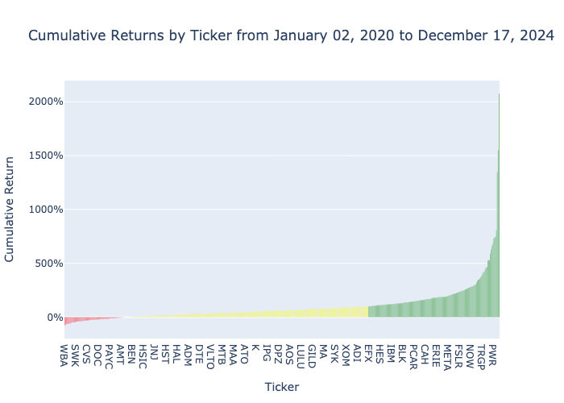

# Analysis of stock data:

Data produced:

```bash
 python run.py
Date range: (datetime.date(2020, 1, 2), datetime.date(2024, 12, 17))
Avg Last Cumulative Return: 99.80%
Median Last Cumulative Return: 61.40%
Percentage of Tickers Greater Than Last Cumulative Return: 30.14%
sector
Technology               37
Finance                  24
Consumer Services        23
Capital Goods            19
Health Care               9
Basic Industries          9
Energy                    8
Public Utilities          6
Consumer Non-Durables     5
Miscellaneous             3
Consumer Durables         2
Transportation            1
```

Example chart:




---

## Prerequisites

1. Ensure requirements are installed:
   ```bash
   python3 -mvenv .venv
   pip install -r requirements.txt
   ```

2. Make sure your `alembic.ini` and `env.py` files are properly configured.

3. Start the Postgres database:
    ```bash
    docker compose up -d
    ```

4. [Apply Migrations](#running-migrations)

## Run

Running:

```bash
python run.py
```

---

## Generating Migrations

1. **Create a New Migration**:
   To generate a migration script based on model changes, run:
   ```bash
   alembic revision --autogenerate -m "Migration description"
   ```
   This will create a new migration script in the `alembic/versions/` directory.

2. **Manually Edit (Optional)**:
   Review the generated migration script and make any necessary changes.

---

## Running Migrations

1. **Apply Migrations**:
   To apply all pending migrations, run:
   ```bash
   alembic upgrade head
   ```

2. **Rollback Migrations**:
   To revert the last migration, run:
   ```bash
   alembic downgrade -1
   ```

   To revert to a specific revision, use:
   ```bash
   alembic downgrade <revision_id>
   ```

---

## Checking Migration Status

1. **Current Revision**:
   Check the current revision applied to the database:
   ```bash
   alembic current
   ```

2. **Migration History**:
   View the history of all migrations:
   ```bash
   alembic history
   ```

3. **Show a Specific Migration**:
   Display details of a specific revision:
   ```bash
   alembic show <revision_id>
   ```

---

For more details, refer to the [Alembic documentation](https://alembic.sqlalchemy.org/en/latest/).
